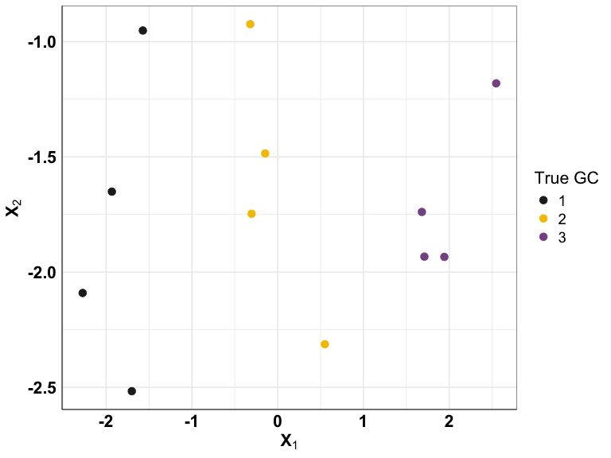
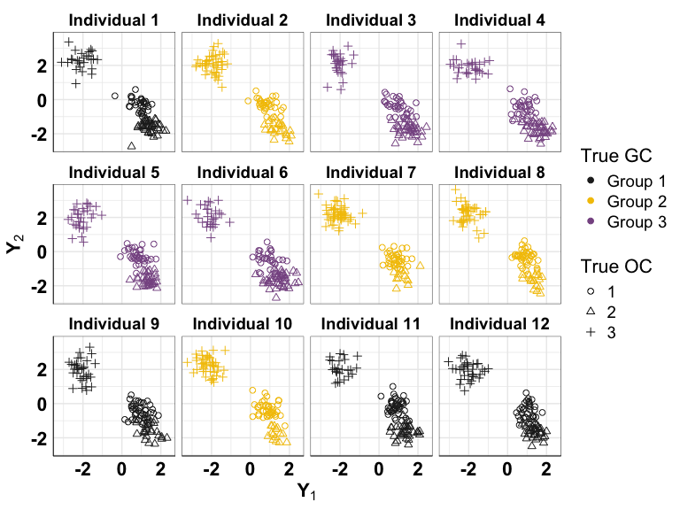
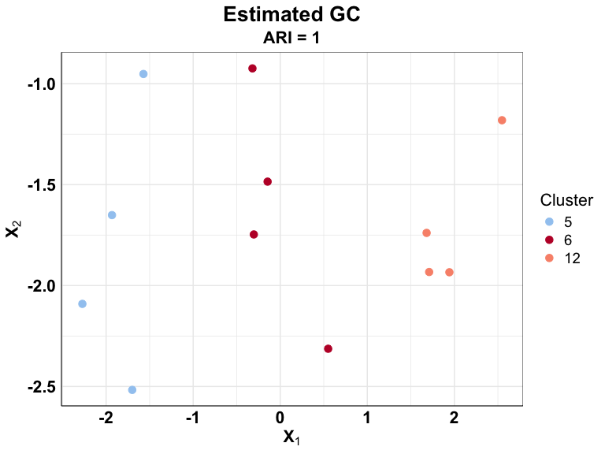
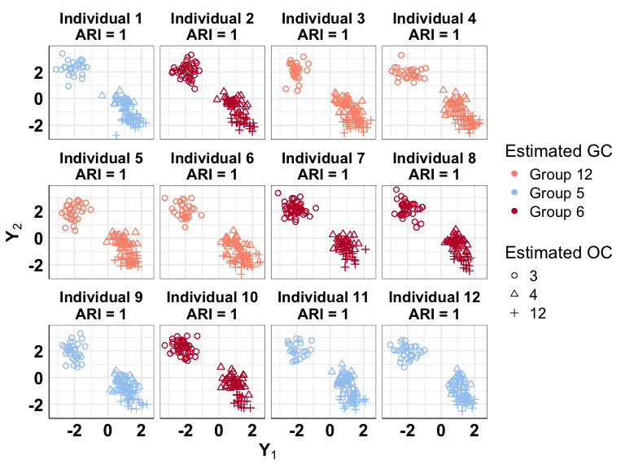

Nested atoms model (NAM)
================

## Decsription of Functions

This document provides a brief description of the various functions in
this repository along with a small example.

The *GenData.R* script consists of the function **Generate_Data** which
can be used to simulate the data from the NAM. The primary arguments of
the function are:

- $J$ corresponds to the number of groups
- $n$ is a vector of length J, consisting of the number of observations
  in each group
- $T.true$ is the true number of group-level clusters
- $q$ is the dimension of group-level variables
- $L.true$ is the true number of observation-level clusters
- $p$ is the dimension of observation-level variables

Here is an example of using the function **Generate_Data**

``` r
source("GenData.R")
J = 12           # Number of groups
n = rep(100, J)  # Number of observations in each group
T.true = 3       # True number of group-level clusters
q = 5            # Dimension of group-level variables
L.true = 3       # True number of observation-level clusters
p = 5            # Dimension of observation-level variables

Data = Generate_Data(T.true = T.true, 
                     alpha0_x = 25,
                     J = J, 
                     q = q,
                     lambda_x = 0.1, # Parameter controlling seperation of group-level variables
                     L.true = L.true,
                     p = p,
                     alpha0_y = 25,
                     n = n, 
                     lambda_y = 0.1, # Parameter controlling seperation of observation-level variables
                     seed.x = 2024,
                     seed.y = 1993, plot = TRUE)
```

The plot of the group-level variables (dimensions 1 and 2) can be
visualized as:

``` r
Data$plot_x
```



The plot of the observation-level variables (dimensions 1 and 2)
segregated by group-clusters can be visualized as:

``` r
Data$plot_y
```



## Function to implement CAVI

The main function implementing the CAVI algorithm for NAM can be found
in the *NAM_VI_MultiRun_Parallel.R* script consisting of the function
**Run_NAM_VI_MultiRun_Parallel**. This function implements multiple
replications of the proposed CAVI algorithm in parallel. The primary
arguments of the function are:

- $X$ corresponds to the group-level data, which is a $q\times J$
  dimensional matrix
- $Y$ corresponds to the observation-level data, which is a J
  dimensional list. Each list is of dimension $p \times n_j$
- $H$ is the layer-1 truncation level (corresponds to $K$ in the
  manuscript)
- $L$ is the layer-2 truncation level
- $max.iter$ is the maximum number of iteration of the CAVI
- $epsilon$ is the threshold to determine convergence of the CAVI

We first source the *NAM_VI_MultiRun_Parallel.R* script. We input as $X$
and $Y$ from the generated data and run 10 independent replications of
the proposed CAVI algorithm in parallel with different starting points.
The output from the **Run_NAM_VI_MultiRun_Parallel** function provides
the run of the proposed CAVI with maximum value of ELBO at converegence
over the 10 independent replications.

``` r
source("NAM_VI_MultiRun_Parallel.R")  # Load the NAM VI function
Out_NAM_VI_MultiRun_Parallel <- Run_NAM_VI_MultiRun_Parallel(numReplicate = 10,
    X = Data$X, Y = Data$Y, H = 30, L = 30, maxIter = 2000, epsilon = 1e-05)
```

We then extract the estimated group- and observational-level clusters as

``` r
GC = Out_NAM_VI_MultiRun_Parallel$est.s
OC = Out_NAM_VI_MultiRun_Parallel$z.est
```

We note that the output from **Generate_Data** (R object *Data* in our
example) consists of **s.true**, which is the true group clusters. This
**s.true** is a vector of length $J$. Similarly, the output from
**Generate_Data** (R object *Data* in our example) consists of
**z_true**, which is the true observational clusters. This **z_true** is
a list of length $J$, with the $j$-th element being a vector of length
$n_j$.

We next calculate the accuracy of clustering at both group- and
observational-level using the adjusted Rand index as:

``` r
ARI_GC = aricode::ARI(Data$s.true, GC)  # Accuracy of group-level clustering
ARI_OC = 0
# Accuracy of observational-level clustering for each group
# separately
for (j in 1:length(OC)) {
    ARI_OC[j] = aricode::ARI(Data$z_true[[j]], OC[[j]])
}
# This is the combined observational-level clustering which
# accounts for sharing of clusters across the groups
ARI_OC_global = aricode::ARI(as.vector(unlist(Data$z_true)),
    Out_NAM_VI_MultiRun_Parallel$z.estimated)
```

The clustering accuracies are summarized as:

- **Group-level**: 1
- **Individual Observational-level**: 1, 1, 1, 1, 1, 1, 1, 1, 1, 1, 1, 1
- **Combined Observational-level**: 1.

## Visualizations

The *Estimated_Plot_Function.R* consists of a helper function that can
be used to visualize group-level and observation-level variables by the
estimated group- and observational-level clusters. The arguments are: -
*Data* from the function **Generate_Data** -
*Out_NAM_VI_MultiRun_Parallel* from the function
**Run_NAM_VI_MultiRun_Parallel**

``` r
source("Estimated_Plot_Function.R")
Plots <- Estimated_Plot_Function(Data = Data, Out_NAM_VI_MultiRun_Parallel = Out_NAM_VI_MultiRun_Parallel)
```

The plot of the group-level variables (dimensions 1 and 2) colored by
estimated group-level clusters can be visualized as:

``` r
Plots$plot_x.est
```



The plot of the observation-level variables (dimensions 1 and 2)
segregated by estimated group-level clusters and by estimated
observational-level clusters can be visualized as:

``` r
Plots$plot_y.est
```


